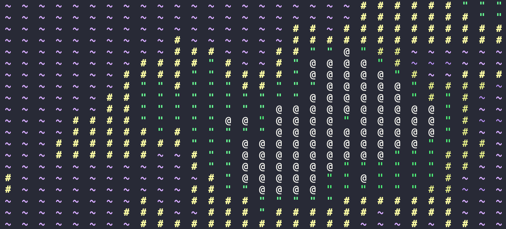
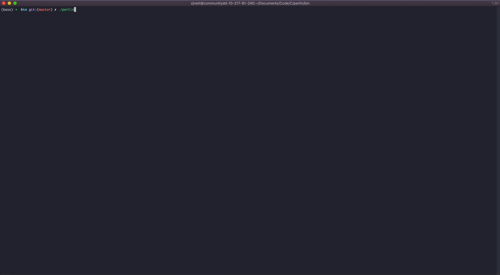

# Perlin Noise
An experiment using perlin noise to generate an ASCII continental 'map'.



## Usage

Basic usage:

```./perlin```

The above will produce a 10x10 map.
Advanced:

```./perlin <vertical size> <horizontal size>```

The command above will produce a variable-sized map up to 1000 x 1000.

## Attribution
[Wikipedia, Perlin Noise](https://en.wikipedia.org/wiki/Perlin_noise) - Algorithm reference

[nowl (John)](https://github.com/nowl) - Perlin noise code reference